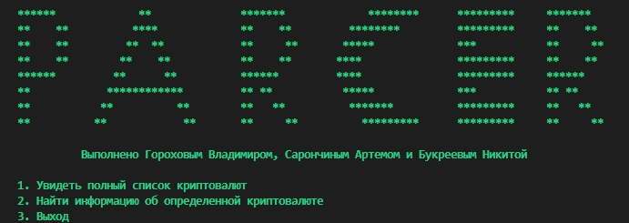
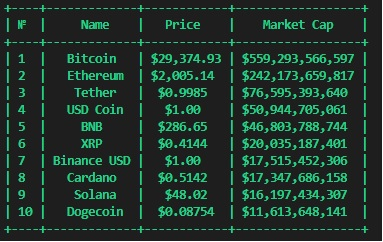
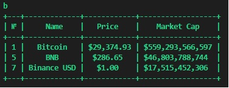

<h1 align="center">Python Parcer</h1>
<h3 align="center"style>Парсер сайта с криптовалютой</h3>

---

<h3 align="center">Описание программы</h3>

- Данная программа является парсером сайта https://coinmarketcap.com/

- Сделана на языке программирования Python 3.7

- Использованы библиотеки Requests и BeautifulSoup
---

<h3 align="center">Возможности программы</h3>

- Выводит актуальные данные в таблицу

- Реализован поиск по названию

- Запись в файл
---

<h3 align="center">Скриншоты</h3>

